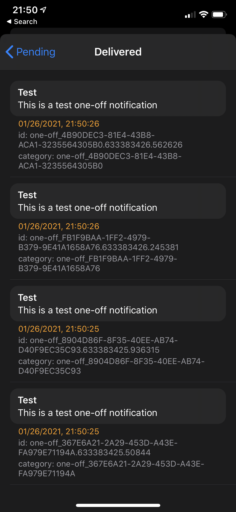
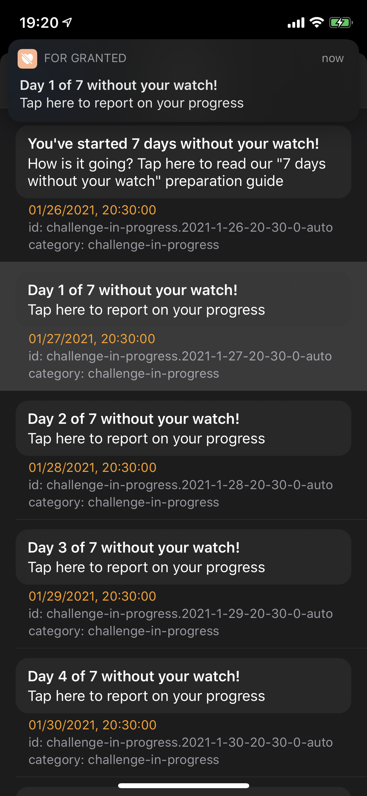

# ScheduledNotificationsViewController


> **[Nice Photon](https://nicephoton.com) is available for hire!** Talk to us if you have any iOS app development needs. We have 10+ years of experience making iOS apps for top Silicon Valley companies. Reach out at [starback@nicephoton.com](mailto:starback@nicephoton.com)

**ScheduledNotificationsViewController** shows you all of your pending local notifications in one place, with all the information you need. Tapping on a notification will immediately trigger its delivery, making this small tool invaluable for debugging local notifications.

Built at **[Nice Photon](https://nicephoton.com)**. Maintainer: [@dreymonde](https://github.com/dreymonde)

Medium story [here](https://medium.com/nice-photon-ios/introducing-schedulednotificationsviewcontroller-67c8b73813e3).

| Scheduled | Delivered | Tap to trigger |
| --- | --- | --- |
|  |  |  |

## Features

- See all scheduled notifications in one place: every notification includes content, next trigger date, an identifier and a category name.
- Tap on a notification in a list to immediately trigger its delivery (you can test live how the notification will look). The "real" notification will still arrive in time!
- Scroll down to see recently delivered notifications (tap "Show Delivered Notifications")
- Supports light and dark mode natively

## Usage

```swift
import UIKit
import ScheduledNotificationsViewController

// ...somewhere in "Settings" screen:

#if DEBUG

let notificationsVC = ScheduledNotificationsViewController()
self.navigationController?.pushViewController(notificationsVC, animated: true)

#endif
```

### Troubleshooting

**Q: My scheduled notifications list is empty**

A: Make sure you have granted notifications permissions to your app on your device. More here: [ Asking Permission to Use Notifications](https://developer.apple.com/documentation/usernotifications/asking_permission_to_use_notifications)

**Q: I tap on a notification in a list, but nothing shows up**

A: Make sure you're using `userNotificationCenter(_:willPresent:withCompletionHandler:)` callback in your `UNUserNotificationCenterDelegate`. More here: [ Handling Notifications and Notification-Related Actions](https://developer.apple.com/documentation/usernotifications/handling_notifications_and_notification-related_actions) (see section *"Handle Notifications While Your App Runs in the Foreground"*)

## Installation

### Swift Package Manager
1. Click File &rarr; Swift Packages &rarr; Add Package Dependency.
2. Enter `http://github.com/nicephoton/ScheduledNotificationsViewController.git`.
